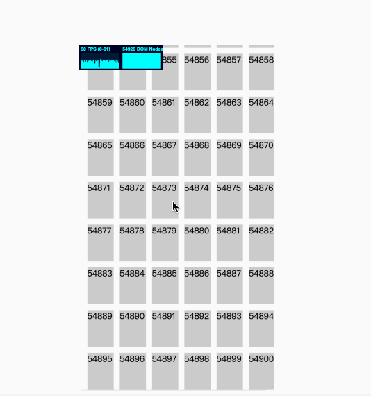
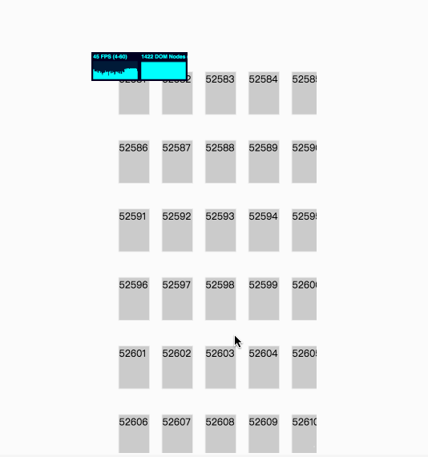
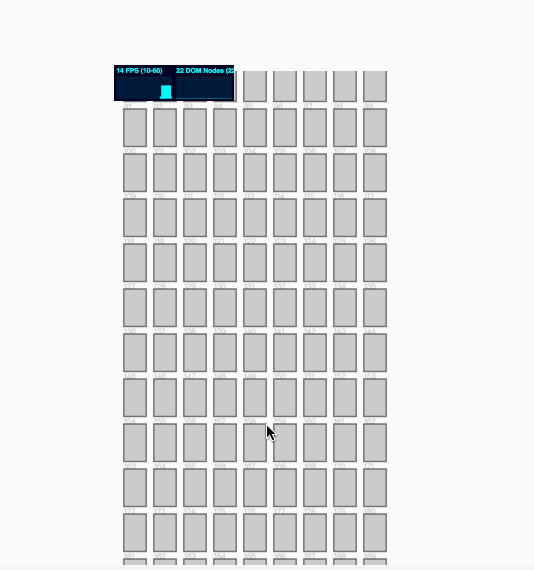

## 基础实现
https://qianyuchang.github.io/ali-quize/

## 问题
Dom 节点过多导致reflow/repaint成本增高，交互不流畅，甚至卡死

## 解决方案
### 0x00  分页
这个在基础实现里已经做了，一次性插入大量节点性能，那么便按需插入，不过指标不治本，DOM数还是那么多

下图可以看出，当页面5w多节点时(只是div+text)，再插入卡顿十分明显了
/

### 0x01 DOM节点回收
通过复用DOM节点使页面DOM数保持相对稳定
这里直接使用了google[这篇文章](https://developers.google.com/web/updates/2016/07/infinite-scroller)的算法

https://qianyuchang.github.io/ali-quize/scroller.html

页面实际呈现的挚友1000多个结点

### 0x02 canvas
本着减少DOM Node的原则，想到了canvas，毕竟canvas只占一个node嘛

实现思路是 

通过样式计算库将 css style 转换为 x, y 坐标，画rect到canvas

在canvas 遮罩一个等高div，监听div onscroll事件为canvas设置translate(0, -scrollTop),并重画

不过实测的性能并不好，对canvas不太熟，不确定是绘画耗性能还是是写法有问题

https://qianyuchang.github.io/ali-quize/canvas.html

### 0x03 产品角度
最后一个方案是产品角度分组
打个比分，选择之前先选所在分组，既能减少用户选座操作成本，又能将实际选座页面的成本控制在 100 Node

| 点击选择 1-100 | 点击选择 101-200 |
| ---- | ---- |
| 点击选择  201-300 | 点击选择 301-400 |
| 点击选择 401-500 | 点击选择 501-600 |
| 点击选择 601-700 | 点击选择 701-800 |

